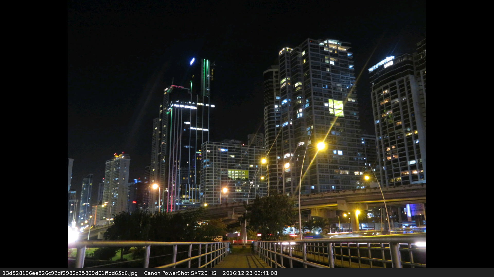

# Overview

This is a Python tool that displays photos directly to a Framebuffer device in
Linux. It can be used to directly drive a photoframe without needing to install
a graphical environment.

This has been used to stably drive a screen from a Raspberry Pi Zero 2 W over a
long period of time (with swap enabled).


# Example Usages

Drive from a folder of images:

```
pfb_slideshow /dev/fb0 /images
```

Displays randomized images from a text file with a list of relative file-paths and a display time of five minutes:

```
pfb_slideshow /dev/fb0 /frame/images.txt --root /frame --time 300 --random
```


# Example Screenshot




# Features

- Prints a gutter at the bottom of the display with filename, EXIF model, and EXIF timestamp
- Can take a list of file-paths instead of a single path. The entries can be absolute or relative.
- Can randomize images
- Can control the delay between images
- Press left/right cursor to navigate through images
- Plays in a loop
